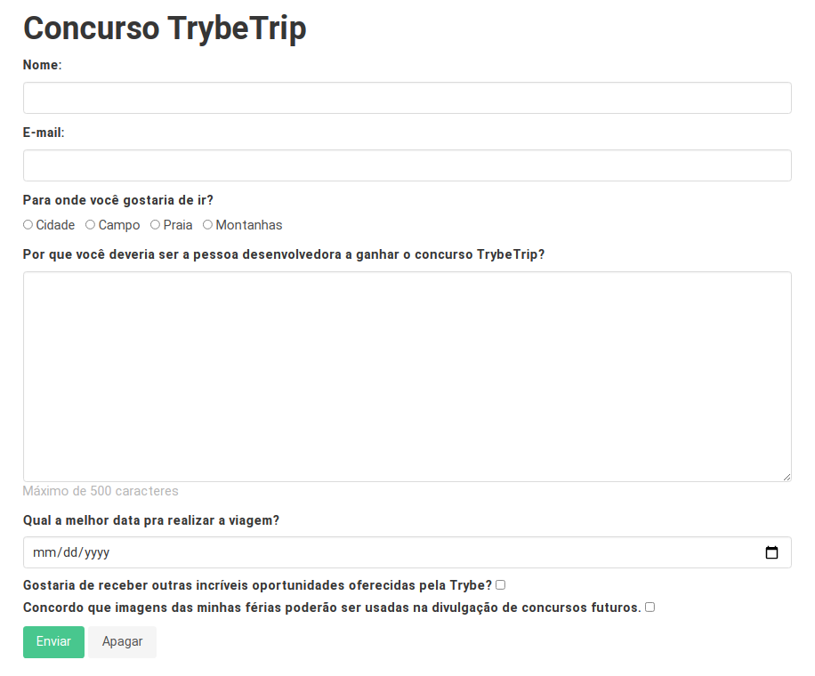

# Dia 2: Bibliotecas JavaScript e Frameworks CSS

## Exercícios desenvolvidos

1. Adicione um framework CSS de sua escolha ao formulário que você construiu na última aula e o utilize para estilizar o formulário.
    * Sugestões: Bulma , Bootstrap , Semantic UI e Materialize .

formBulma.html